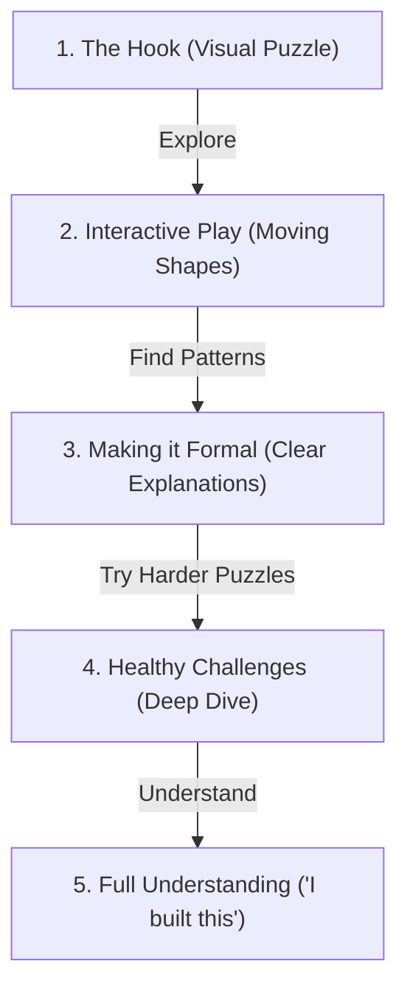

# Intuition-First Learning Platform

An educational platform designed to change how we learn. Instead of memorizing rules, formulas, or textbook jargon, this platform helps users build deep, logical intuition for math and other concepts. Users learn by active doing, moving objects, and visualizing relationships so they can say: *"I understand this now because I built it."*

---

## Current Goals

1. **Build the Interactive Foundations**: Create a flexible, interactive platform that supports smooth visual helpers and active practice.
2. **First Module: Pythagorean's Theorem**: Teach the theorem from the ground up. Instead of just presenting $a^2 + b^2 = c^2$, show users how shapes work by letting them move and play with areas to see the logic.
3. **Expand the Math Curriculum**: Move step-by-step into other math topics (like Calculus, Graphing, or Logarithms) using the same visual approach.
4. **Interactive Sandbox**: Let users play with shapes, formulas, and graphs directly to see changes in real-time, building a clear mental picture.

---

## Teaching Model: Starting from the Big Picture

Traditional math lessons usually start with dry rules, move to solving equations, and finally show a word problem.

Our approach does the opposite:
1. **The Hook**: Start with a concrete question or visual puzzle that makes you curious.
2. **Interactive Play**: Guide the user to move a visual system (like sliding shapes or rearranging tiles) to find the pattern themselves.
3. **Making it Formal**: Introduce math terms and formal explanations *after* the user has developed a visual feel for it.
4. **Healthy Challenges**: Push the difficulty as far as the user's curiosity goes, presenting interesting puzzles that test their understanding.

---

## Ideal Screen and Layout Structure

The interface is designed to keep users focused, prevent mental clutter, and make learning feel hands-on.

### 1. The Welcome and Pathfinder (Home and Navigation)
*   **Feel**: Welcoming, calm, and clear.
*   **Layout Elements**: 
    *   A clean, modern interface featuring a dark layout and clean text.
    *   A visual "trail map" rather than a dense list of lessons. Users see their current position, where they came from, and their next destination clearly.
    *   No guilt-inducing daily streak counters or pressure-filled progress bars. Progress is shown as a shifting perspective—revealing how different topics connect as they are unlocked.

### 2. The Core Learning Screen
*   **Split-Screen Interface**:
    *   **Left Pane (The Guide)**: Plain English explanation, guiding questions, and helpful hints.
    *   **Right Pane (The Sandbox)**: An interactive canvas where users drag, rotate, slide, and rearrange shapes or graphs.
*   **Tactile feedback**: Smooth animations when dragging and dropping, and clear visual changes.

### 3. The Helpful Feedback Loop
*   **Getting it Wrong**: Instead of red "X" marks or failure sounds, wrong answers prompt curiosity. The platform suggests: *"It looks like you're measuring the outer border instead of the space inside. Try resizing the corner squares to see how their areas scale."* We support and guide creative attempts.
*   **Getting it Right**: Confirmation is simple and clear. No loud popups or virtual badges. The real reward is that the user understands the concept. Correct answers offer optional deep dives or short historical stories.

---

## First Topic: Pythagorean's Theorem

We start by deconstructing the theorem. Rather than starting with the formula, the user solves a puzzle.

### Step 1: The Area Puzzle (The Hook)
*   We show a right-angled triangle. We build squares on its three sides.
*   The user is asked to compare the area of the two smaller squares with the area of the largest square.

### Step 2: Rearranging Pieces (The Play)
*   **Interaction**: The user drags and splits the smaller squares' pieces to pack them exactly inside the larger square.
*   **Intuition**: The user physically sees that the space occupied by the smaller squares is identical to the space occupied by the larger square.

### Step 3: Sliding Shapes (The Explanation)
*   **Interaction**: The user slides a shape between two parallel lines, showing that the total space it covers (area) stays the same even as it leans over.
*   **Intuition**: This visual guide makes classic, rigorous proofs of the theorem feel natural and clear.

### Step 4: Bringing in the Algebra
*   Only now do we show the formula: $a^2 + b^2 = c^2$. The algebra is introduced as a simple shorthand language to describe the shape puzzle they just solved.

---

## Tech Stack and Development Setup (Proposed)

*   **Frontend**: Vite + React or Next.js (to handle the different screens and interactive shapes easily).
*   **Styling**: Vanilla CSS with custom variables (clean dark colors, simple layouts that fit different screens).
*   **Interactive Visualizations**: HTML5 Canvas, SVG, or simple drawing libraries to handle shape dragging and movement.
*   **Math Text**: KaTeX to display clear, clean formulas.
*   **Look and Feel**: Clean dark mode, clear accent colors, modern typography, and smooth transitions.
